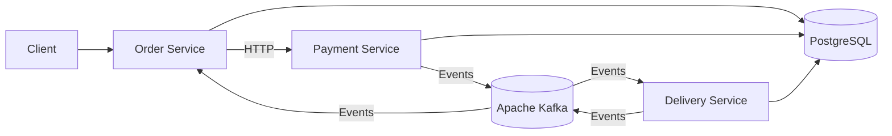

# Order Platform

Order Platform is a learning backend project built around a microservice architecture using Spring Boot and Apache Kafka.

The system models the complete order lifecycle by distributing responsibilities across independent microservices: 
Order Service manages orders, Payment Service handles payment processing, and Delivery Service is responsible for delivery operations. 
The services communicate through both synchronous HTTP calls and asynchronous Kafka events.

---

## Architecture

The system consists of three application services and one shared module:

* **Order Service** — manages the order lifecycle and acts as the main entry point.
* **Payment Service** — handles payment-related operations.
* **Delivery Service** — handles delivery processing.
* **Common Libs** — contains code shared between modules.

The services use both HTTP communication and Kafka events.



The current version uses a shared PostgreSQL instance for simplicity.

---

## Project Structure

```text
order-platform/
├── common-libs/
│   └── shared code and contracts
│
├── order-service/
│   └── order management
│
├── payment-service/
│   └── payment processing
│
├── delivery-service/
│   └── delivery processing
│
├── docker-compose.yaml
├── build.gradle.kts
├── settings.gradle.kts
├── gradlew
└── gradlew.bat
```

The repository is implemented as a Gradle multi-module project.

---

## Tech Stack

### Backend

* Java 21
* Spring Boot
* Spring Web
* Spring Data JPA
* Spring Kafka
* Hibernate

### Messaging

* Apache Kafka

### Database

* PostgreSQL 16

### Mapping and Boilerplate Reduction

* MapStruct
* Lombok

### Build and Infrastructure

* Gradle
* Gradle Kotlin DSL
* Docker
* Docker Compose

---

## Services

### Order Service

The Order Service is responsible for the order lifecycle.

Its responsibilities include:

* receiving order-related requests;
* storing and updating orders;
* communicating with the Payment Service;
* producing and consuming Kafka events;
* reacting to delivery-related events.

It represents the main entry point into the order-processing workflow.

---

### Payment Service

The Payment Service is responsible for payment-related processing.

Its responsibilities include:

* receiving payment requests;
* storing payment-related state;
* publishing events after payment processing;
* participating in the order workflow.

---

### Delivery Service

The Delivery Service is responsible for delivery processing.

Its responsibilities include:

* consuming order/payment events from Kafka;
* processing delivery-related logic;
* publishing delivery events back to Kafka.

---

### Common Libs

`common-libs` contains code shared by the application modules.

Shared modules should preferably contain only code that genuinely represents a common contract, such as:

* event DTOs;
* shared value objects;
* small infrastructure abstractions.

Business logic should remain inside the service that owns it.

---


## Running Locally

### Requirements

Make sure you have installed:

* Java 21
* Docker
* Docker Compose

You do not need to install Gradle separately because the repository contains the Gradle Wrapper.

---

### 1. Clone the repository

```bash
git clone https://github.com/altw8n/order-platform.git
cd order-platform
```

---

### 2. Start infrastructure

Start PostgreSQL and Kafka:

```bash
docker compose up -d
```

Check container status:

```bash
docker compose ps
```

The local infrastructure includes:

* PostgreSQL;
* Apache Kafka.

---

### 3. Build the project

```bash
./gradlew build
```

---

### 4. Run the services

#### Order Service

```bash
./gradlew :order-service:bootRun
```

#### Payment Service

```bash
./gradlew :payment-service:bootRun
```

#### Delivery Service

```bash
./gradlew :delivery-service:bootRun
```

---

### 5. Stop infrastructure

```bash
docker compose down
```

To also delete persistent PostgreSQL and Kafka volumes:

```bash
docker compose down -v
```
